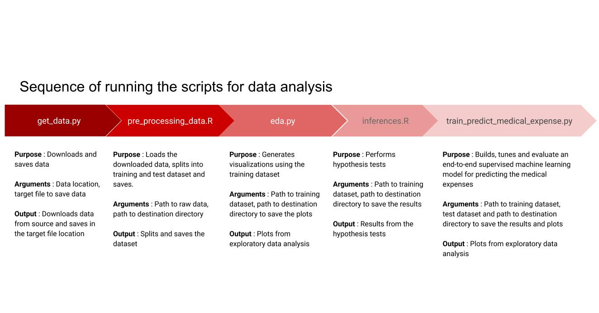

### Research Question

For this project we are working on the following main predictive research question.

  "Given a person's information, what would be his/her predicted medical expenses?"

We are also investigating two inferential sub-questions given below.

- Is there a significant difference of expenses between smokers and non-smokers? (inferential)
- Is there a significant difference of expenses between males and females? (inferential)

### Analysis Plan

Knowing the estimated medical expenses in advance is very critical for insurance companies to set their yearly premiums to beneficiaries. They should make sure that the amount they spent on beneficiaries is less than the total premium they receive. Using a predictive model that predicts the expected medical expense of a customer, the insurance companies get an estimate of how much premium to charge on each segment of customers such that the cost results in reasonable profit to the company. Using such predictive models, they can identify potentially high risk customers and charge a higher premium from such customers.  In this project, we attemp to build a regression model that will help us predict the medical expenses of a person given information such as age, sex, number of children, smoking habits, and the region where the person is from. In the process, we are also interested in figuring out   if there is a significant difference of expenses between smokers and non-smokers, and between males and females. 

For our predictive modeling, the analysis plan is summarised below : 
    
  - Transform numeric features using PolynomialFeatures and StandardScaler in sci-kit  learn.  
  - Transform categorical features using OneHotEncoder in sci-kit learn.  
  - Get base performance using the following regression models.  
      1. Linear Regression  
      2. KNN Regressor  
      3. DecisionTreeRegressor  
      4. RandomForestRegressor  
      5. SVR(SupportVectorRegressor)  
  - Choose a model from above based on performance  
  - Perform hyper-parameter tuning  
  - Evaluate the model using the following metrics  
      1. Mean absolute error  
      2. Mean squared error  
      3. Root mean squared error  
      4. R2 Score  
      5. Explained varoance score  
  - Plot predicted expense vs actual expense plot and residual plot   
        

For the sub-questions, we will be running two two-sided hypothesis tests, comparing the means of the different groups under study. 

### Exploratory Data Analysis

- In order to know if medical expenses increases with age, and also its bifurcation on sex, we are going to plot the expense VS the age for each sex.

- In order to know if medical expenses increases with age, and also its bifurcation on smokers and non-smokers, we are going to plot the expense VS the age for smokers and non-smokers.

### Results of Analysis

We evaluated our inferential and predictive models using the following evaluation metrics.   
  - Evaluation metrics  
      1. Mean absolute error    
      2. Mean squared error    
      3. Root mean squared error    
      4. R2 Score    
      5. Explained varoance score    
  - Best fit line plot   
      1. Predicted expense vs Actual expense plot and residual plot    
- p-values for inferential sub-questions  

Details of the results can be found in the final report.  

### Running data analysis
